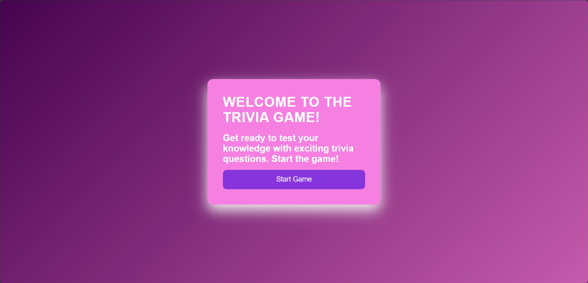
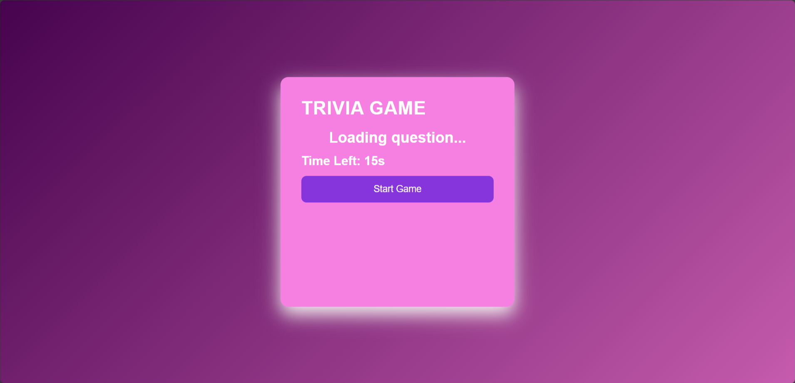
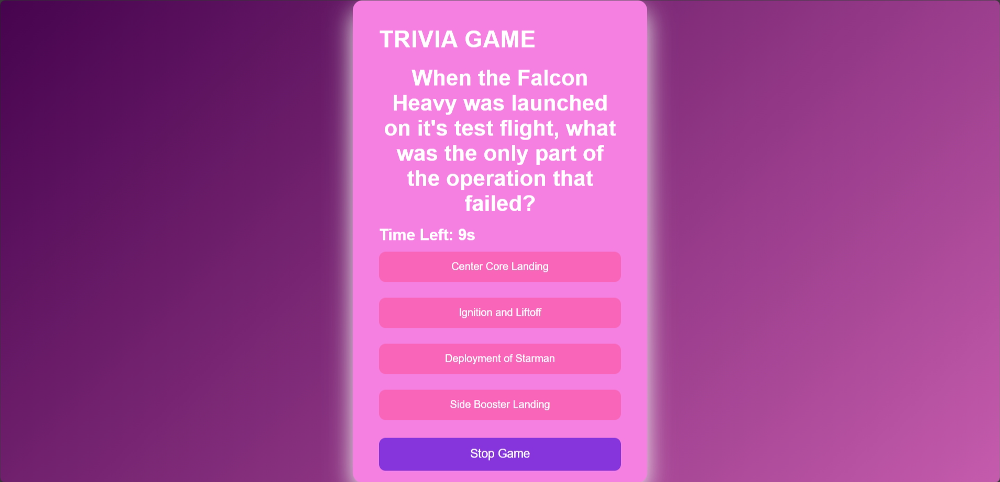
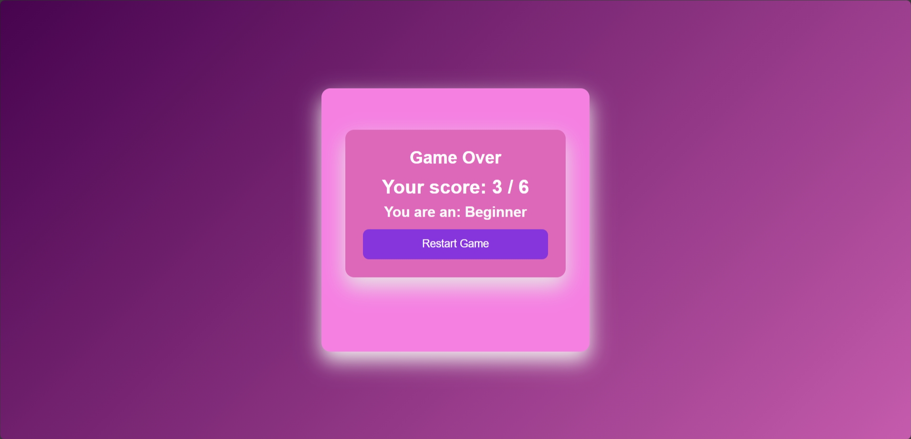

Trivia Games

Trivia games are a type of game where participants answer questions based on their knowledge of various subjects. The questions can cover a wide range of topics, such as history, science, pop culture, sports, geography, literature, and more.
### Team Name: Innovators

### Team Members
- Member 1: Devika Chettayil- College of ngineering and Management Punnapra Allapuzha
- Member 2: Alfisa Nazar - College of ngineering and Management Punnapra Allapuzha
  

### Hosted Project Link
[mention your project hosted project link here]

### Project Description

Trivia games are designed to test and enhance knowledge, as well as provide entertainment.  Trivia requires players to recall information from memory, which can help improve cognitive functions, such as recall and retention. 

### The Problem statement
The goal of the trivia game is to provide an engaging and educational experience where players can test and improve their general knowledge across various subjects. The game will challenge players to recall facts and answer questions correctly to earn points, fostering critical thinking, memory recall, and social interaction.

### The Solution
We are creating a solution that blends fun, engaging gameplay, and knowledge testing with exciting questions and telling you at what level you are. To keep the excitement high, players will earn points for answering all questions correctly within a given time.

## Technical Details
### Technologies/Components Used
For Software:
- HTML, CSS, JavaScript
- Vanilla HTML, CSS, and JavaScript
- Vanilla HTML, CSS, and JavaScript
- HTML, CSS, JavaScript, Text Editor/IDE, Web Browser, Version Control

### Implementation
For Software:
1. HTML (Structure)
HTML is used to create the basic structure of the website. The layout includes:
Welcome screen (welcome.html).
Trivia game screen (index.html).
Buttons for navigation and interaction (e.g., "Start Game" and "Stop Game").
2. CSS (Styling)
CSS is used to style the website, giving it an aesthetic and user-friendly interface.
Provides a gradient background for a dynamic look.
Adds padding, margins, and rounded corners to elements.
Button and hover effects to make the interface interactive.
3. JavaScript (Functionality)
JavaScript is the core of the interactivity and logic of the Trivia game.
Handles game flow: starting the game, displaying questions, showing results.
Tracks user scores and provides feedback after each answer.
Implemented a timer to keep track of the time for each question.
Manages score and game result categorization (e.g., Beginner, Intermediate, Expert).
4. Git (Version Control)
Usage: Git is used to manage project versioning and ensure collaborative development.
Keeps track of changes made in code.
Enables pushing updates to the project repository, ensuring the latest version is available for team members.
5. GitHub (Hosting and Repository Management)
Usage: GitHub is used to host the project code and manage the repository.
Allows multiple contributors to work on the project.
Serves as the online platform for version control, project collaboration, and storing the final project for access.
6. Text Editor (VS Code)
Usage: Visual Studio Code (VS Code) is used as the primary code editor.
Provides syntax highlighting, error checking, and integrated terminal.
Easy integration with version control (Git) for commit and push operations.
7. Browser
Usage: The web browser (Chrome/Firefox) is used to run and test the project locally, seeing how the website looks and behaves during the development process.
Allows interactive testing of the trivia game (answering questions, displaying results, etc.)

# Installation
git clone https://github.com/DevikaPC2003/trivia_games

# Run
cd trivia-games
start welcome.html
start index.html

### Project Documentation
For Software:
Project Overview

The Trivia Game is a web-based application where users can test their knowledge on various trivia topics. The game allows users to  answer multiple-choice questions, and receive a score at the end. It features a user-friendly interface and a countdown timer for each question.

Features
- Start the game
- Answer multiple-choice questions.
- Timer for each question.
- Score and level display after the game.

Technologies Stack
-Frontend: HTML, CSS, JavaScript.
-Deployment: GitHub Pages.

Project Structure
- `welome.html`: Main trivia game page.
- `index.html`: Main trivia game page.
- `style.css`: Styling for the game.
- `app.js`: JavaScript for game logic and interactions.

# Screenshots (Add at least 3)

# Diagrams
![Workflow](The workflow for the trivia game is designed as follows:

Welcome Page:

User is greeted with a welcome page containing the game’s title and a "Start Game" button.
The user can navigate to the game page by clicking the "Start Game" button.
Game Initialization:

Upon pressing "Start Game," the system initializes the trivia game. This includes setting up the timer, and fetching trivia questions.
A countdown timer begins when the game is ready.
Trivia Questions and Answers:

The user is presented with a question and multiple answer choices.
A timer is active, and the user has a limited time to answer each question.
User Input and Feedback:

The user selects an answer. After selection, feedback is provided indicating whether the answer was correct or incorrect.
If correct, the user proceeds to the next question. If incorrect, it is shown whether incorrect.
Game Over and Score:

Once the stop button is pressed, the game ends.
The user’s score is displayed and level of player is displayed, and they can restart the game or return to the welcome screen.
)

# Build Photos

### Project Demo
# Video
[https://www.loom.com/share/f59364676db24fd7af8fa9dfb45102ca?sid=d34cbadf-0bbe-44ba-84a7-8a0f676088c1]

## Team Contributions
- Devika Chettayil: Contributed to designing app.js and style.CSS
- Alfisa Nazar: Contributed to designing index.html and welCome.html

---
Made with ❤️ at TinkerHub
